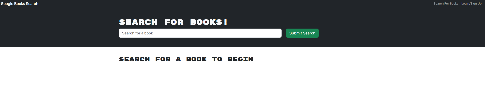
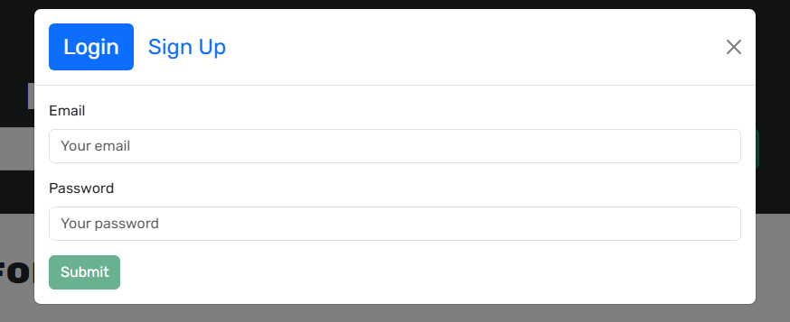
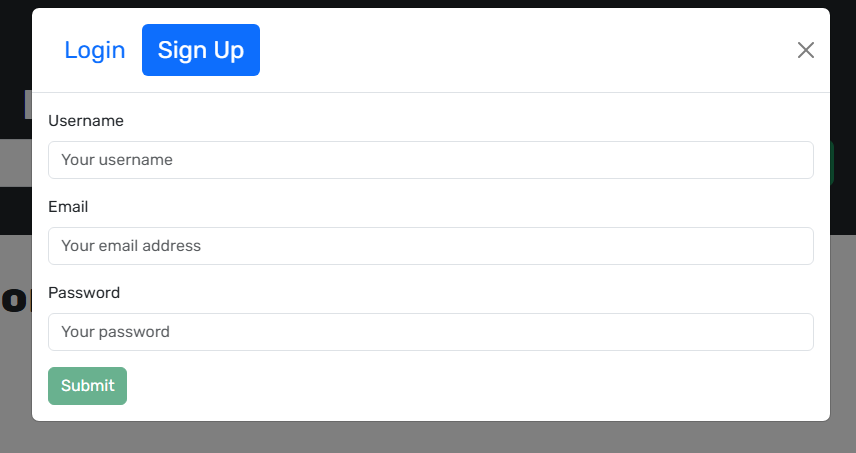
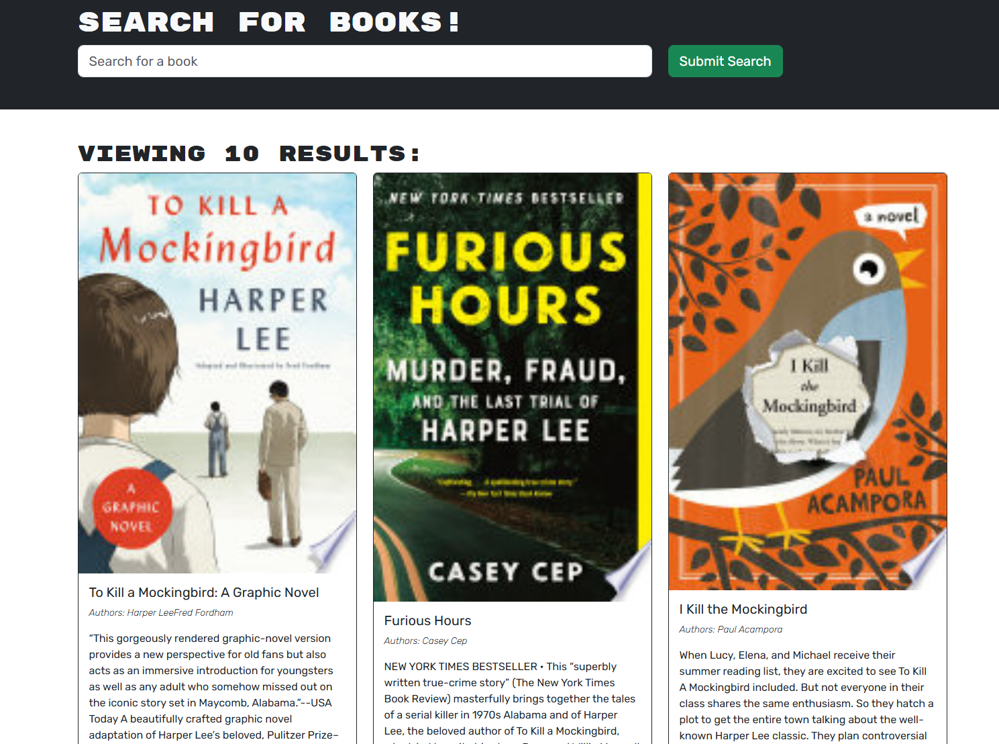
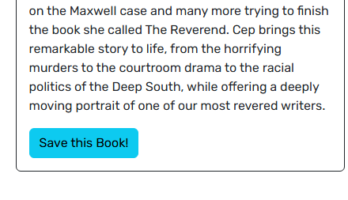
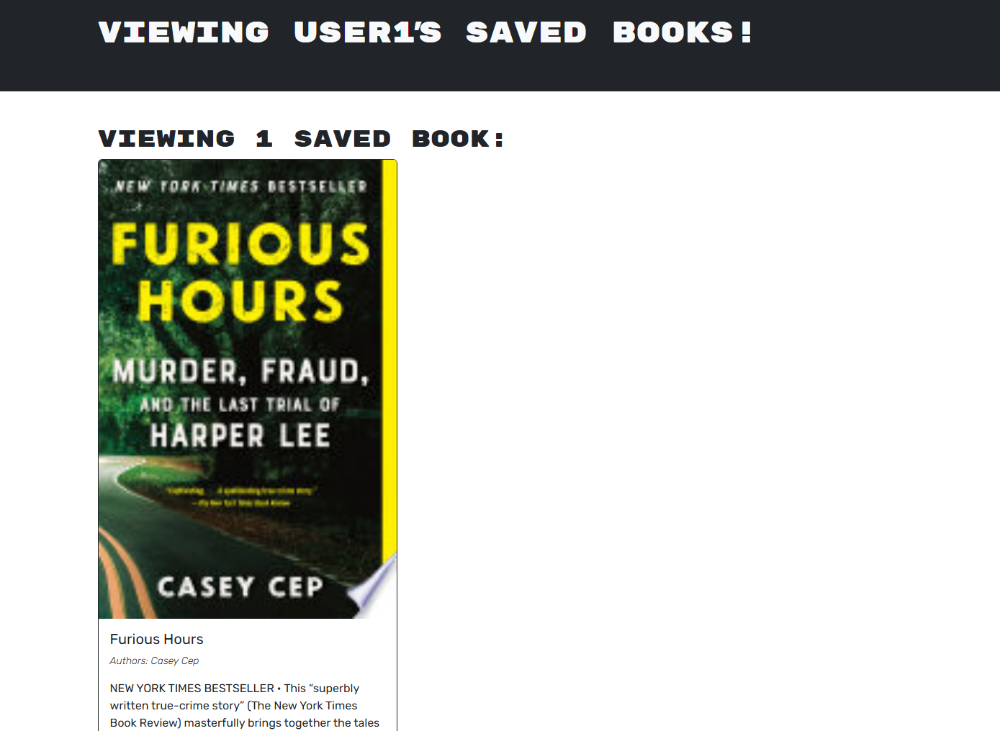
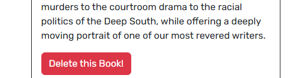

# GoogleBookSearch

## Description

This project is of a search engine using Google Books API with a RESTful API setup. The goal of this was to convert it to use a GraphQL API built with Apollo Server. The app was built using the MERN stack with a React front end, MongoDB database, and Node.js/Express.js server and API. Users can search up books they're interested in and create a profile that allows them to save books. Viewing their personal saved books list they also have the capability to remove them. From this project I was able to apply coding concepts of GraphQL and build a project implementing Apollo Server. This project also helps to strengthen my understanding of other technologies such as MongoDB database, React, Node.js, Express.js and APIs.

To complete the assignment, you’ll need to do the following:

1. Set up an Apollo Server to use GraphQL queries and mutations to fetch and modify data, replacing the existing RESTful API.

2. Modify the existing authentication middleware so that it works in the context of a GraphQL API.

3. Create an Apollo Provider so that requests can communicate with an Apollo Server.

4. Deploy your application to Render with a MongoDB database using MongoDB Atlas. Use the [Deploy with Render and MongoDB Atlas](https://coding-boot-camp.github.io/full-stack/mongodb/deploy-with-render-and-mongodb-atlas) walkthrough for instructions.

## Table of Contents

- [Description](#description)
- [Installation](#installation)
- [Usage](#usage)
- [Credits](#credits)

## Installation

If running locally, commands to run in the terminal to launch are 'npm run build' then 'npm run develop'.

Here is a link to the deployed website: https://googlebooksearch-zieo.onrender.com

## Usage

When the project is loaded, this is the landing page presented.

In the top right corner there is clickable text that will prompt a login/sign up pop-up.

This is what it looks like when you search for a book in the search bar. Each book has its own card that has a button to save the book.

If a book is saved this is what the page will look like and the option to remove the saved book.

## Credits

Below is my GitHub profile. Any suggestions to improve functionality and code, feel free to reach out to me!

GitHub: https://github.com/AVue00

